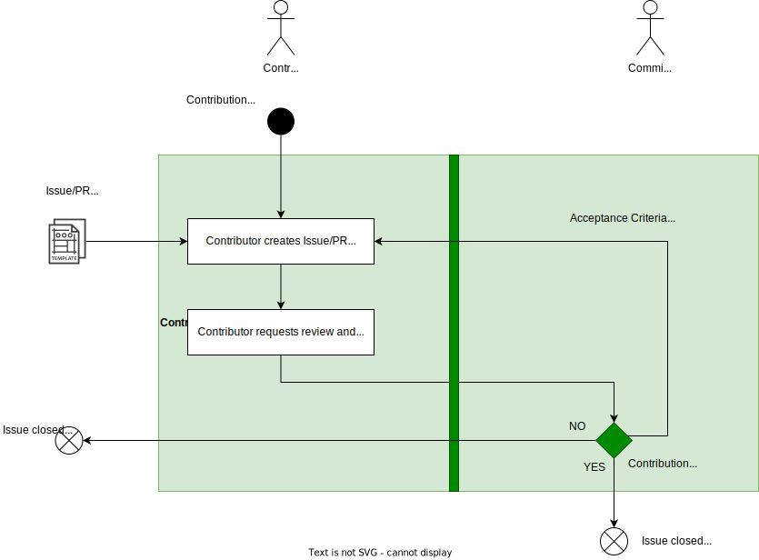

# Eclipse Safe Open Vehicle Core (SCORE)
The [Eclipse Safe Open Vehicle Core](https://projects.eclipse.org/projects/automotive.score) project aims to develop an open-source core stack for Software Defined Vehicles (SDVs), specifically targeting embedded high-performance Electronic Control Units (ECUs).
Please check the [documentation](https://eclipse-score.github.io) for more information.
The source code is hosted at [GitHub](https://github.com/eclipse-score).

The communication mainly takes place via the [`score-dev` mailing list](https://accounts.eclipse.org/mailing-list/score-dev) and GitHub issues & pull requests (PR). And we have a chatroom for community discussions here [Eclipse SCORE chatroom](https://chat.eclipse.org/#/room/#automotive.score:matrix.eclipse.org).

Please note that for the project the [Eclipse Foundation’s Terms of Use](https://www.eclipse.org/legal/terms-of-use/) apply.
In addition, you need to sign the [ECA](https://www.eclipse.org/legal/ECA.php) and the [DCO](https://www.eclipse.org/legal/dco/) to contribute to the project.

## Contributing
### Getting the source code & building the project
Please refer to the [README.md](README.md) for further information.

### Getting involved

#### Setup Phase
This phase is part of the eclipse Incubation Phase and shall establish all the processes needed for a safe development of functions. Only after this phase it will be possible to contribute code to the project. As the development in this project is driven by requirements, the processes and needed infrastructure incl. tooling will be established based on non-functional Stakeholder_Requirements<!-- TODO: fill link to correct page with requirements -->. During setup phase the contributions are Bug Fixes and Improvements (both on processes and infrastructure).

#### Bug Fixes and Improvements
Improvements are adding/changing processes and infrastructure, bug fixes can be also on development work products like code.
In case you want to fix a bug or contribute an improvement, please perform the following steps:
1) Create a PR by using the corresponding template ([Bugfix PR template](.github/PULL_REQUEST_TEMPLATE/bug_fix.md) or [Improvement PR template](.github/PULL_REQUEST_TEMPLATE/improvement.md)). Please mark your PR as draft until it's ready for review by the Committers (see the [Eclipse Foundation Project Handbook](https://www.eclipse.org/projects/handbook/#contributing-committers) for more information on the role definitions). Improvements are requested by the definition or modification of [Stakeholder Requirements](docs/stakeholder_requirements) or [Tool Requirements](docs/tool_requirements) and may be implemented after acceptance/merge of the request by a second Improvement PR. The needed reviews are automatically triggered via the [CODEOWNERS](.github/CODEOWNERS) file in the repository.
2) Initiate content review by opening a corresponding issue for the PR when it is ready for review. Review of the PR and final merge into the project repository is in responsibility of the Committers. Use the [Bugfix Issue template](.github/ISSUE_TEMPLATE/bug_fix.md) or [Improvement Issue template](.github/ISSUE_TEMPLATE/improvement.md) for this.

Please check here for our Git Commit Rules in the [Configuration_Tool_Guidelines](https://eclipse-score.github.io/score/process_description/guidelines/index.html).

Please use the [Stakeholder and Tool Requirements Template](https://eclipse-score.github.io/score/process_description/templates/index.html) when defining these requirements.

#### Additional Information
Please note, that all Git commit messages must adhere the rules described in the [Eclipse Foundation Project Handbook](https://www.eclipse.org/projects/handbook/#resources-commit).

Please find process descriptions here: [process description](https://eclipse-score.github.io/score/process_description/).
