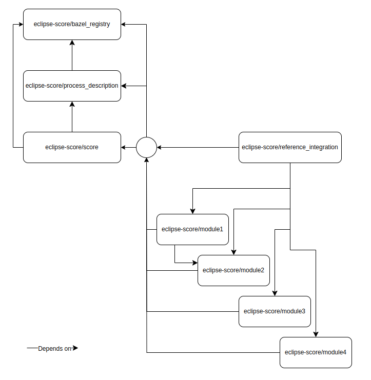

..
   # *******************************************************************************
   # Copyright (c) 2024 Contributors to the Eclipse Foundation
   #
   # See the NOTICE file(s) distributed with this work for additional
   # information regarding copyright ownership.
   #
   # This program and the accompanying materials are made available under the
   # terms of the Apache License Version 2.0 which is available at
   # https://www.apache.org/licenses/LICENSE-2.0
   #
   # SPDX-License-Identifier: Apache-2.0
   # *******************************************************************************

.. _integration_features:

Integration
###########

Documentation
*************

Description
===========

Bazel is the build/test infrastructure of choice for the Score project.
Overall integration and build should be realized using available rules
or custom rules developed for the project. This means that the following
should be integrated with bazel:

-  code build
-  documentation build
-  test runs
-  binary runs
-  external tooling

Running external tooling outside of Bazel should be limited as much as
possible, in order to streamline the development with simple ``bazel
{build,test,run}`` command, across multiple repositories and multiple
languages.

All dependencies should be managed thru mechanisms available in Bazel.
Dependency to host system should be limited as much as possible.

Each repository should register an entry in the bazel_registry for
dependency management between different modules.

High level integration dependency

|score_high_level_dependencies|

Mandatory repositories:

-  bazel_registry (implicit dependency, stores version of all modules)
-  process_description (Score development process description)
-  score (requirements and architecture)
-  reference_integration (brings all parts together)

Optional repositories:

-  repositories containing implementation of particular features

Incubation repositories
=======================

For early evaluation of existing implementations and prototypes we introduce
so called `incubation repositories`.
They should serve as a prototyping area where developers can share and build
code with only limited restrictions such as quality KPIs, review processes, etc.

Incubation repositories are indicated by the prefix `inc_` in the repo name.

Any incubation repository shall evolve over time towards a fully functional
Bazel module, which can be integrated via an additional dependency in the main
build.

If a repo has reached this state and the concept is approved in general the
content can be used as input for the score production repositories.

This means that the existing code can be transferred to the production
repositories as copy via the contribution process. The incubation
repository will be archived at this point in time.

The content shall be disabled via a Bazel `feature flag` with the following
naming convention `//experimental_[feature]`.
The `experimental` prefix indicates to the user that
this functionality is not yet ready for series production.
Additionally the relevant code might not meet all required quality KPIs.

References
==========

-  Bazel: https://bazel.build/
-  Bazel modules: https://bazel.build/external/module
-  Bazel registries: https://bazel.build/external/registry

