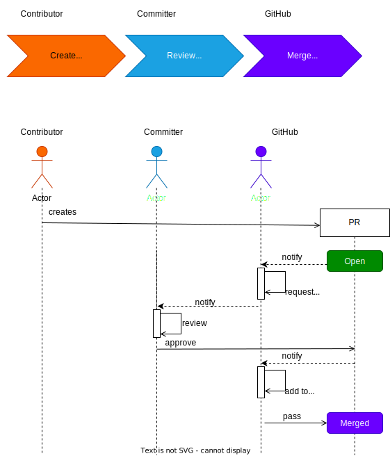
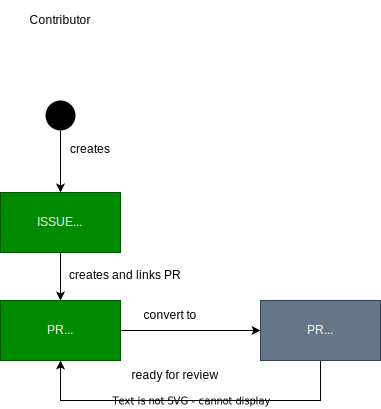

..
   # *******************************************************************************
   # Copyright (c) 2024 Contributors to the Eclipse Foundation
   #
   # See the NOTICE file(s) distributed with this work for additional
   # information regarding copyright ownership.
   #
   # This program and the accompanying materials are made available under the
   # terms of the Apache License Version 2.0 which is available at
   # https://www.apache.org/licenses/LICENSE-2.0
   #
   # SPDX-License-Identifier: Apache-2.0
   # *******************************************************************************

###############################
 Contribution Request Guideline
###############################

.. gd_guidl:: Contribution Request Guidance
  :id: GD_GUIDL__Contr_Request_Guidance
  :status: valid
  :tags: contribution_management

Contributions to the *SCORE* project are the key to grow the content including the code. Contributions may cover simple improvement proposals, bug or problem reports, but also more complex scope changes of features up to new feature requests. Depending on the contribution scope, several steps may be required to finally merge it within the *SCORE* repository.

This guidance shall help the contributor (:need:`Contributor <RL_contributor>`) to find the right path for his contribution.

For simple contributions, like fixing bugs or improvements, just creating a *PR* is sufficient.

For more complex contributions, like adding a new feature, where it's unfitting to just open a PR, open an *GitHub Issue* to discuss with the community before starting work on it, would be the preferred way.

You can also join our `Slack <https://sdvworkinggroup.slack.com/archives/C083Z4VL90B>`_ for real-time discussions.

The *SCORE* project defines a Contribution Request (**COR**) as any defined and allowed trigger to start the active contribution to the *SCORE* project. That means obviously that a *PR* is a Contribution Request.

Summary:

* You want to report something (like a bug) or start a discussion where you do not know the code solution yet, open a *GitHub Issue* (:need:`GD_GUIDL__Issue_Guidance`).
* You want to manage complex coordination problems (planning activities) that require collaboration across multiple stakeholders, open a *GitHub Issue* (:need:`GD_GUIDL__Issue_Guidance`).
* You want to propose a scope change of a feature or a new feature, open a *GitHub Issue* (:need:`GD_GUIDL__Issue_Guidance`) and add required PRs to that *GitHub Issue*.
* You want to report a bug or problem including a code solution? Start with a *PR* (:need:`GD_GUIDL__Pull_Request_Guidance`).
* You want to propose an improvement (also to a process or other work products) including a code solution? Start with a *PR* (:need:`GD_GUIDL__Pull_Request_Guidance`).

Whenever your *PR*  gets too big or involves committs of several contributors , we strongly encourage to open and link a *GitHub Issue*, so this can get better planned.

For a *PR* to be merged, in any case an approval of a committer is needed. If the committer decides, that only a *PR* is not sufficient and a *GitHub Issue* is needed, then the contributor shall also create a corresponding *GitHub Issue*.

*GitHub Issue* are categorized using various types. For categorizing of PRs using of labels, e.g. bug or improvement, is mandatory, see `Platform Management Plan <https://eclipse-score.github.io/score/platform_management_plan/project_management.html>`_.

For all possibilites the project contains simple templates (provided by committers (:need:`Committer <RL_committer>`)).

(ToDo link here to the templates overview).
Feature request: TODO-ref`feature_request_template`

*****************************
 What is a Pull Request (PR)?
*****************************

.. gd_guidl:: Pull Request Guidance
  :id: GD_GUIDL__Pull_Request_Guidance
  :status: valid
  :tags: contribution_management

A Pull Request (**PR**) is the **ONLY** way to contribute **CODE** to the *SCORE* project.

The figure below shows a simplified workflow for a PR.

* The contributor (:need:`Contributor <RL_contributor>`) starts by creating a PR:  `Creating a Pull Request (Github Docs) <https://docs.github.com/en/pull-requests/collaborating-with-pull-requests/proposing-changes-to-your-work-with-pull-requests/creating-a-pull-request>`_.
* Required reviewers will be automatically assigned based on the contributed content (via CODEOWNERS).
* If the content fullfils the review and acceptance criteria, a committer (:need:`Committer <RL_committer>`) will approve the *PR* and thus it can be merged.

  Simple *PR* based contribution request workflow overview

Content in general may contain features, requirements, architectural designs, modules, components, detailed designs, implementations and source code, tests, process descriptions, any documentations, guidelines, tutorials, tools, or infrastructure topics and more of the *SCORE* project. In case of doubt or for any other input we strongly encourage to open a *GitHub Issue* (:need:`GD_GUIDL__Issue_Guidance`) first.

The *PR* should provide all required information of the new or changed content. Therefore the *SCORE* project provides content specific templates, which the contributor (:need:`Contributor <RL_contributor>`) must use for his *PR* (ToDo link here to the templates overview). Templates may be *PR* templates, *GitHub Issue* templates and also additional document or work product templates.

The content of any *PR* is the commit content and the description as well as the comments given in GitHub and is kept in a versioned repository, their revision history is the historical record of the PR.

This historical record is available by the normal git commands for retrieving older revisions, and can also be browsed on GitHub.

**************************************
Detailed *SCORE* Pull Request Workflow
**************************************

This chapter is only for optional read to understand the details for the Pull Request workflow defined in *SCORE*.

The figure below gives an overview about all the possible steps for a *PR* until it is either accepted or rejected.

.. figure:: _assets/score_contribution_request_standard.drawio.svg
  :width: 100%
  :align: center
  :alt: Detailed *SCORE* Pull request workflow overview

  Detailed *SCORE* Pull request workflow overview

Create a PR
===========

The contributor (:need:`Contributor <RL_contributor>`) creates a PR.

Reviewers will be automatically assigned (:need:`Committer <RL_committer>`) based on the contributed content (ruleset as defined by the committers). In addition several checks for the contributed content (ToDo: Link to the description of the checks) will be started.

Review and merge a PR
=====================

A *PR* is reviewed with all content that adds/modifies it. As long as a *PR* requires further work by the contributor (:need:`Contributor <RL_contributor>`), the *PR* is not approved and thus not merged and further changes are requested. Once the contributor (:need:`Contributor <RL_contributor>`) considers all review comments as resolved, :need:`Contributor <RL_contributor>` can re-request a review. The committer (:need:`Committer <RL_committer>`) reviews the *PR* content according the *SCORE* review and acceptance criteria (ToDo link here to the criteria).
Further the contributor (:need:`Contributor <RL_contributor>`) must resolve found issues from the automated checks, if they do not pass.

As long as the *PR* does not meet the defined criteria and the checks does not pass, it will not be approved. If it does not follow the required templates, based on the provided content or the templates are not filled out properly, the committer as reviewer (:need:`Committer <RL_committer>`) will place the *PR* to the "Draft" state.

It is then the responsibility of the contributor (:need:`Contributor <RL_contributor>`) to add the missing information and to re-start the contribution by placing the *PR* back for review.

To change from "Draft" to "Open" see `Changing the stage of a pull request (Github Docs) <https://docs.github.com/en/pull-requests/collaborating-with-pull-requests/proposing-changes-to-your-work-with-pull-requests/changing-the-stage-of-a-pull-request>`_.

At any point the contributor (:need:`Contributor <RL_contributor>`) may decide not to continue with the PR, then the contributor (:need:`Contributor <RL_contributor>`) just closes the PR.

What is a GitHub Issue?
=======================

.. gd_guidl:: Issue Guidance
  :id: GD_GUIDL__Issue_Guidance
  :status: valid
  :tags: contribution_management

A *GitHub Issue* is the way to report bugs or propose improvements without knowing the solution and to request features (incl. scope changes).

For creating *GitHub Issue* compare here:  `Creating a GitHub Issue (Github Docs) <https://docs.github.com/en/issues/tracking-your-work-with-issues/using-issues/creating-an-issue>`_.

Create an *GitHub Issue* to collect feedback, before investing too much effort into a *PR*. *GitHub Issues* may be accompanied by draft *PRs* if code is to be shown.

It can also be used to collect community input and for planning and tracking activities.

The figure below shows options to report something.

  Reporting options overview
